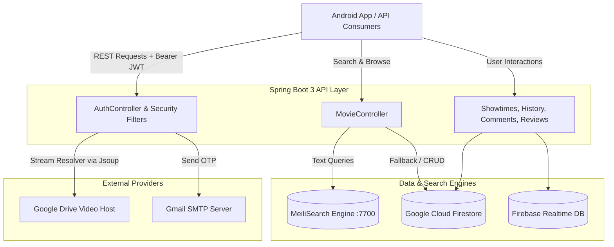

# App_xem_Phim_API — Movie Streaming Backend Service

[](https://spring.io/projects/spring-boot)
[](https://www.oracle.com/java/)
[](https://www.meilisearch.com/)
[](https://firebase.google.com/docs/firestore)
[](https://www.docker.com/)

A RESTful backend microservice supporting the [AppXemPhim](https://github.com/vucongchien/AppXemPhim) Android movie streaming platform. Built with **Spring Boot 3**, it provides high-throughput catalog management, typo-tolerant full-text search via **MeiliSearch**, a Google Drive streaming URL extractor via **Jsoup**, and stateless **JWT** token lifecycle management.

---

## 🌟 Key Capabilities

* **Full-Text Movie Search**: Integrated with MeiliSearch for sub-millisecond query responses, multi-attribute filtering (genres, release year, nation, rating), and automated index synchronization from Firestore.
* **Stream Resolution Proxy**: Automated extraction of direct streaming URLs from Google Drive shared links via Jsoup HTML form parsing (`/auth/video`).
* **Authentication & Token Lifecycle**:
  * Dual-token system: Short-lived Access Token + long-lived Refresh Token via JJWT.
  * Silent refresh endpoint (`/auth/resettoken/{refreshToken}`).
  * Password recovery with OTP delivery via Gmail SMTP.
* **Cloud NoSQL Integration**: Cloud Firestore and Firebase Realtime Database integration for user profiles, watch history, bookmarks, and nested comment structures.
* **Interactive API Documentation**: Auto-generated OpenAPI / Swagger UI interface.

---

## 🏗️ Architecture & Data Pipelines

### System Architecture



### 1. Search & Auto-Indexing Workflow
* **Startup Sync (`@PostConstruct initMeiliIndex()`)**: Automatically pulls all documents from the Firestore `Movies` collection, configures searchable attributes (`title`, `description`) and filterable attributes (`genres`, `nation`, `rating`, `years`), then batch-indexes them into MeiliSearch.
* **Search Routing**: When a search parameter `title` is supplied to `GET /api/v1/movies`, the service delegates query execution to MeiliSearch. If omitted, it falls back to Firestore paginated retrieval (`Pageable`).

### 2. Video Streaming Extractor Pipeline (`GET /auth/video?url={driveUrl}`)
Google Drive requires confirmation to stream or download large files. The API uses Jsoup to:
1. Connect via HTTP to the Google Drive preview/download page.
2. Inspect the DOM for `form#download-form`.
3. Extract generated action tokens and hidden inputs.
4. Construct and return the direct streamable URL directly to the Android ExoPlayer client.

---

## 🛠️ Tech Stack Matrix

| Component | Technology | Version | Purpose |
| :--- | :--- | :--- | :--- |
| **Framework** | Spring Boot | `3.2.5` | Core RESTful application framework |
| **Runtime** | OpenJDK | `17` | Execution runtime |
| **Search Engine** | MeiliSearch SDK | Latest | Fast typo-tolerant full-text search engine |
| **Database** | Firebase Admin SDK | `9.2.0` | Cloud Firestore & Realtime Database client |
| **Security** | Spring Security + JJWT | `0.11.5` | JWT creation, verification, and request filter |
| **HTML Parser** | Jsoup | `1.15.4` | Google Drive download form extraction |
| **Mail** | Spring Boot Starter Mail | `3.2.5` | OTP delivery over SMTP TLS (Port 587) |
| **Documentation** | SpringDoc OpenAPI UI | `2.5.0` | Swagger UI interactive interface |
| **Containerization**| Docker & Docker Compose | Multi-stage | Container deployment for app & MeiliSearch |

---

## 📁 Package Structure

```text
com.appxemphim.firebaseBackend/
├── config/             # MeiliSearch & bean configurations
├── controller/         # REST Controllers (Auth, Movie, ShowTimes, History, Comment, etc.)
├── dto/
│   ├── request/        # Request payloads (MovieRequest, ShowTimeRequest, SetPassWordRequest)
│   └── response/       # Response schemas (MovieDTO, FavoriteDTO, EmailDTO)
├── exception/          # GlobalExceptionHandler & ResourceNotFoundException
├── model/              # Domain entities (Movie, Account, Comment, ShowTime, History)
├── security/           # JwtUtil, JwtRequestFilter, SecurityConfig
├── service/            # Business logic (MovieService, AccountService, ShowTimesService)
└── Utilities/          # Firebase, GoogleUtilities (Drive service builder)
```

---

## 🔌 API Reference Highlights

| Method | Endpoint | Description | Auth Required |
| :--- | :--- | :--- | :---: |
| **POST** | `/auth/login/{uid}` | Exchange Firebase UID for JWT Access + Refresh Tokens | No |
| **GET** | `/auth/resettoken/{refreshToken}` | Issue a new Access Token via Refresh Token | No |
| **PATCH** | `/auth/repass` | Reset user account password | No |
| **GET** | `/auth/video` | Resolve direct streaming URL from Google Drive link | No |
| **GET** | `/api/v1/movies` | Search and filter movies (MeiliSearch or Firestore) | No |
| **GET** | `/api/v1/movies/{id}` | Get detailed movie metadata (`MovieDTO`) | No |
| **POST** | `/api/v1/movies` | Create a movie and trigger search reindexing | Yes |
| **GET** | `/showtimes` | Query theater showtimes by weekday or date | No |
| **GET** | `/history/{uid}` | Retrieve user watch history and playback progress | Yes |
| **POST** | `/history` | Update movie watch progress percentage | Yes |
| **POST** | `/comment` | Post a top-level or reply comment | Yes |
| **POST** | `/email/send-otp` | Send verification OTP to email | No |

Interactive Swagger documentation is available at:
```text
http://localhost:8081/swagger-ui/index.html
```

---

## ⚙️ Setup & Deployment

### Prerequisites
* **Java**: OpenJDK 17 or higher
* **Maven**: 3.9+ (or use included `./mvnw`)
* **Docker & Docker Compose** (recommended for running MeiliSearch)

### 1. Configuration & Secrets
The application requires secret properties configured in `src/main/resources/application_secret.properties`:

```properties
# Firebase credentials JSON string or file path
FIREBASE_CREDENTIALS_JSON={"type":"service_account", ...}

# Mail configuration (App Password for Gmail SMTP)
spring.mail.username=your-email@gmail.com
spring.mail.password=your-app-password
```

### 2. Run with Docker Compose (Recommended)
This starts both **MeiliSearch** (port 7700) and the **Spring Boot API** (port 8081) in an isolated network:

```bash
# Start all containers in detached mode
docker compose up -d --build

# View real-time logs
docker compose logs -f backend
```

### 3. Run Locally with Maven
If you prefer running the Spring Boot application on your local machine:

1. Start MeiliSearch first:
   ```bash
   docker run -d -p 7700:7700 -e MEILI_MASTER_KEY=chiendepvl getmeili/meilisearch:latest
   ```
2. Run the application:
   ```bash
   ./mvnw spring-boot:run
   ```

The server binds to `http://0.0.0.0:8081/`.

---

## 🧪 Testing & Verification

### Postman Collection
A pre-configured Postman collection containing standard requests (Authentication, Movie CRUD, Filters, Video URLs) is available in the root folder:
* File: [`APPXEMPHIM1.postman_collection.json`](APPXEMPHIM1.postman_collection.json)

Import this file into Postman to test endpoints against `http://localhost:8081`.

### Automated Tests
Run the test suite using Maven:
```bash
./mvnw test
```

---

## ⚖️ Architectural Notes & Trade-offs

* **Firestore vs. MeiliSearch Synchronization**: MeiliSearch indexes are loaded during application startup (`@PostConstruct`) and updated on new movie creation. In high-concurrency environments, event-driven synchronization (e.g., Firestore Triggers or Kafka) is recommended over in-process hooks.
* **Direct Google Drive Streaming**: Extracting direct links via Jsoup relies on Google Drive's current HTML structure. For commercial production environments, serving video chunks via an HLS/DASH CDN (e.g., Cloudflare Stream or AWS CloudFront) offers superior resilience and adaptive bitrate playback.
